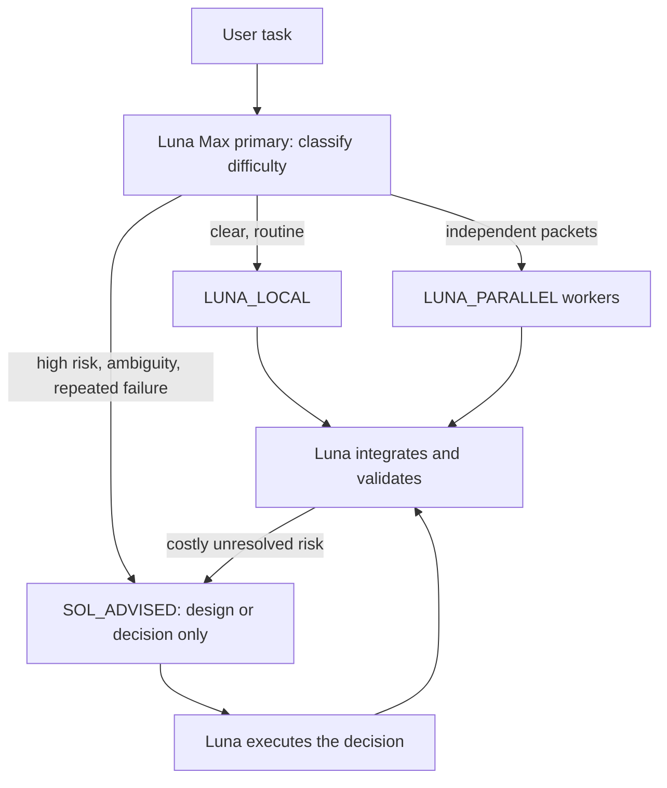

# Luna-first / Sol-advisor Codex workflow

[中文说明](README.md)

This configuration uses **GPT-5.6 Luna Max** as the everyday primary model and execution layer, escalating only genuinely difficult decisions to a **GPT-5.6 Sol Advisor**.

“Unlimited ammunition” is a metaphor: subagents still consume tokens and remain subject to account limits, model access, and concurrency caps. The goal is to conserve Sol usage, not bypass limits.

## Architecture



The old design kept Sol in the primary thread and required Sol acceptance for every substantial task. That consumed Sol tokens even when Luna could understand, implement, and validate the work. The new design makes Luna Max the default, parallelizes only independent packets, and calls Sol with one explicit hard question plus evidence.

## Install

Merge these files into a project:

```text
.codex/config.toml
.codex/agents/luna-worker.toml
.codex/agents/sol-advisor.toml
AGENTS.md
```

For personal agents, copy the two agent files to `~/.codex/agents/`. A valid custom agent needs `name`, `description`, and `developer_instructions`; setting only `model` and `model_reasoning_effort` is incomplete.

Start a new Codex task after installation so configuration is reloaded.

## Automatic routes

- `LUNA_LOCAL`: clear requirements and low/medium risk; one Luna thread is cheaper than delegation.
- `LUNA_PARALLEL`: at least two independent, disjoint, separately verifiable packets.
- `SOL_ADVISED`: architecture, security, data integrity, destructive migration, cross-system contracts, material ambiguity, or two failed evidence-based attempts.

Sol should answer a bounded decision question, not implement the whole feature. Luna resumes execution after the decision.

## Truthfulness gate

Files on disk do not prove that a Codex build, account, or tool loaded a model. Report Luna or Sol usage only when agent activity or a tool result identifies that model. See [verification](docs/verification.md).

## License

[MIT](LICENSE)
