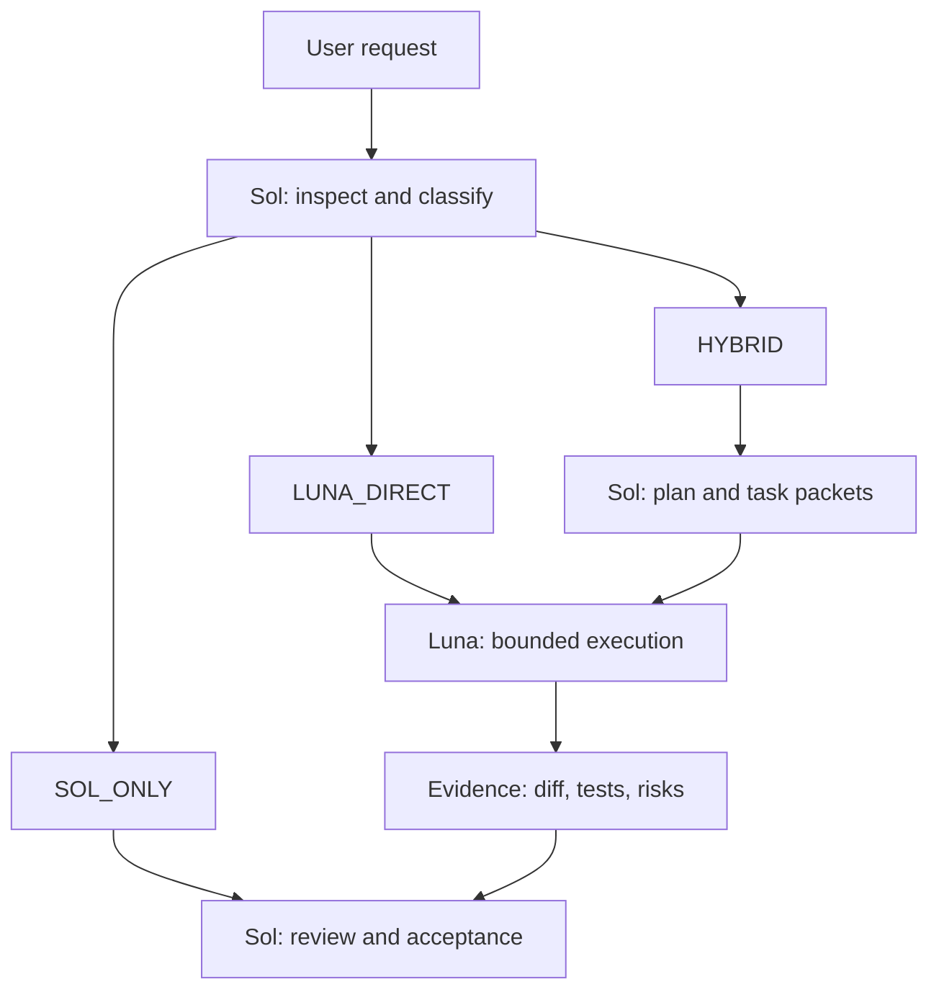

# Sol–Luna Engineering Workflow

[中文说明](README.md)

A practical supervisor–executor workflow for Codex:

- **GPT-5.6 Sol** is the supervisor, architect, planner, reviewer, and final acceptor.
- **GPT-5.6 Luna** is the execution worker for bounded, testable, reversible tasks.
- **Sol uses medium reasoning by default** and escalates to high only for genuinely difficult decisions.

The goal is not “always use the strongest setting.” The goal is to spend strong reasoning where judgment matters and fast execution where the work is already well specified—without trading away correctness, safety, or engineering quality.

> [!IMPORTANT]
> This repository is a reference configuration, not an OpenAI product guarantee. Model access, project-level custom agents, configuration keys, and UI behavior can vary by Codex version and account. Verify support in your environment before relying on automatic delegation.

## Architecture



The workflow separates two decisions:

1. **Who owns the work?** `SOL_ONLY`, `LUNA_DIRECT`, or `HYBRID`.
2. **How much Sol reasoning is justified?** `medium` by default, `high` only when evidence shows that a harder judgment remains.

## Quick start

### 1. Copy the project files

Copy these files into the root of your repository:

```text
.codex/config.toml
.codex/agents/luna-executor.toml
AGENTS.md
```

If your repository already has either configuration file, merge the fields instead of replacing existing rules. Do not create a second `[agents]` table in TOML.

### 2. Start a new Codex task

Project configuration is normally loaded when a task starts, so open a new task in the configured repository.

### 3. Ask normally

You do not need a magic command. For example:

```text
Add input validation to the profile form and run the targeted tests.
Follow the repository's Sol–Luna routing rules.
```

Sol should classify the task before substantial work begins and delegate only when the packet is bounded and verifiable.

## Explicit controls

Use these prompts when you want to override or test routing:

```text
Treat this as LUNA_DIRECT and delegate it to luna_executor.
```

```text
Treat this as HYBRID. Sol should inspect, plan, define acceptance criteria,
delegate bounded implementation to Luna, then inspect the diff and accept it.
```

```text
Keep this SOL_ONLY. Do not delegate architecture or security decisions.
```

```text
Use Sol high only for the unresolved hard decision. Return routine execution
to medium after that decision is resolved.
```

## Routing at a glance

| Route | Use when | Owner |
|---|---|---|
| `LUNA_DIRECT` | Scope, behavior, tests, and rollback are clear | Luna executes; Sol accepts |
| `HYBRID` | Substantial implementation can be split into safe packets | Sol plans; Luna executes; Sol accepts |
| `SOL_ONLY` | Requirements, architecture, security, or blast radius are unresolved | Sol |

Good Luna tasks include targeted implementation, tests, mechanical refactors, precise exploration, documentation, and repetitive edits across disjoint files.

Keep architecture, security boundaries, authentication, payments, difficult migrations, breaking interfaces, subtle concurrency, dependency selection, and final acceptance with Sol.

See [the routing guide](docs/routing-guide.md) for decision rules and examples.

## The Luna task packet

Delegation quality depends more on the packet than on the model name. Every packet should contain:

- objective;
- relevant context;
- files or modules in scope;
- explicit out-of-scope areas;
- constraints;
- acceptance criteria;
- required validation commands;
- expected return format;
- escalation conditions.

Use the copyable [task packet template](docs/task-packet.md).

## Verification

Configuration existing on disk is not proof that your Codex version loaded it. Verify in layers:

1. Parse both TOML files.
2. Confirm there is exactly one `[agents]` table.
3. Start a new task in the repository.
4. Ask for the minimal delegation test below.
5. Confirm the task identifies `LUNA_DIRECT` and attributes execution to `luna_executor`.
6. Inspect the actual diff and test result yourself.

Minimal test prompt:

```text
Create docs/delegation-smoke-test.md containing exactly one line:
"Delegation smoke test passed."

Classify this task first. If project-level custom agents are supported, delegate
the edit to luna_executor. Validate the exact file content, then have Sol inspect
the diff and report final acceptance. Do not change any other file.
```

If your interface does not recognize project-level custom agents, use the same packet manually with a Luna task/subagent, or keep Sol as supervisor and explicitly select Luna for the bounded execution task. See [verification and fallbacks](docs/verification.md).

## Why medium Sol by default?

Most repository work does not need maximum reasoning throughout. Planning, review, and debugging with a clear hypothesis generally fit medium. Escalate to high only when targeted evidence leaves a difficult question unresolved—for example, a high-blast-radius architecture decision, competing root-cause hypotheses, a subtle security or compatibility trade-off, or two failed evidence-based attempts.

High is a temporary escalation for a specific unresolved question, not a badge for “important task.”

## Design principles

- **Evidence before escalation.** State the unresolved question and evidence already gathered.
- **Smallest correct diff.** Luna does not refactor unrelated code.
- **One writable owner per file.** Parallel agents write only to disjoint file sets.
- **Validation is mandatory.** Generated code is not accepted code.
- **No self-acceptance.** Luna reports evidence; Sol owns final judgment.
- **Stop on ambiguity.** Luna escalates rather than guessing through design decisions.
- **Return to medium.** Once the hard decision is resolved, routine work resumes at normal effort.

## Repository contents

```text
.
├── .codex/
│   ├── config.toml
│   └── agents/
│       └── luna-executor.toml
├── docs/
│   ├── routing-guide.md
│   ├── task-packet.md
│   └── verification.md
├── AGENTS.md
├── CONTRIBUTING.md
├── LICENSE
├── README.md
└── README.en.md
```

## License

[MIT](LICENSE)
